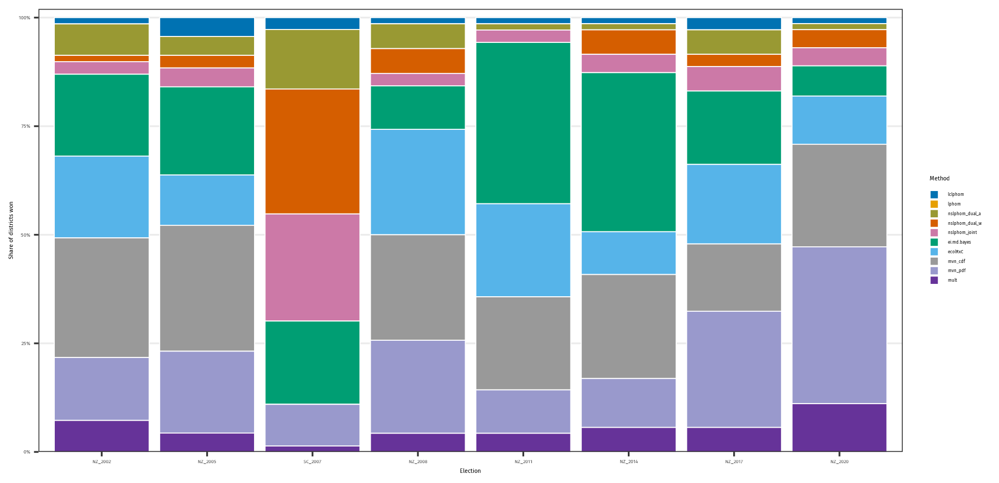
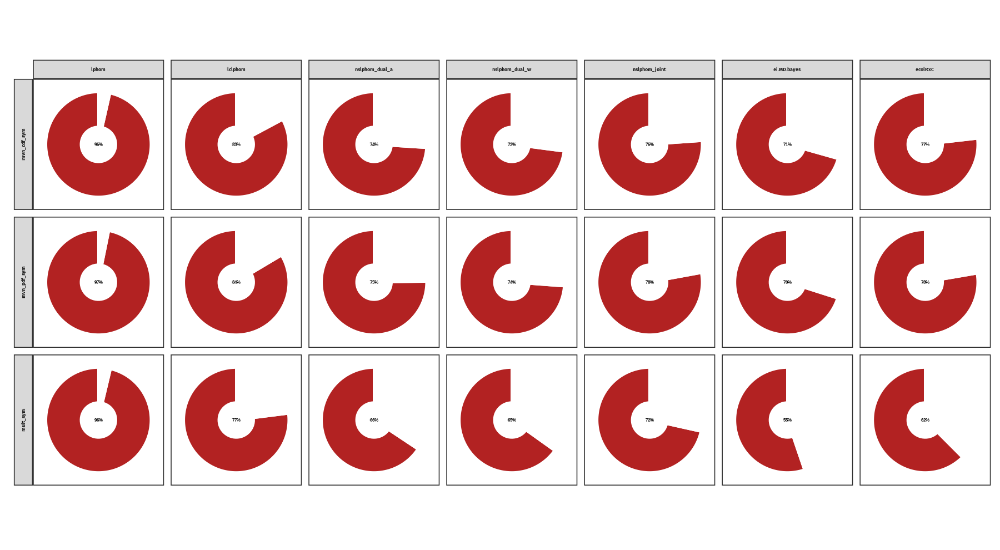

# Non-Parametric Ecological Inference Supplementary Material

R scripts with the supplementary material for the paper “An Accurate, Fast, and Scalable Ecological Inference Algorithm for the R×C Case,” by P. Ubilla, D. Hermosilla, and C. Thraves. 

- Layout: `src/` holds scripts and shared helpers; `output/` stores intermediate results such as `ei_instances`, `simulated_instances`; `figures/` receives generated PDF plots.

## Scripts
- Generate EI datasets: `Rscript src/run_instances.R`.

- Simulated instances MAE plots: `Rscript src/plot_errors.R`

- Running time plots: `Rscript src/plot_time.R` (runtime vs candidates) using `output/simulated_instances`.

- EI dataset wins by district: `Rscript src/plot_districts.R --out=figures/nz_relative_wins.pdf [--workers=8] [--limit-inst=N] [--parallel=true]`.

- Pairwise method pies: `Rscript src/pie_chart.R [outfile] [--field=EI_V] [--inst-like=ei_] [--limit-inst=N] [--workers=M] [--parallel=true] [--higher-better=true]`

- Differences and p-values: `Rscript src/p_values.R <target_method> [field_to_test] [--inst-like=ei_] [--limit-inst=N] [--workers=M] [--parallel=true]`.

- EI instance table: `Rscript src/table.R <field_to_average> [outfile.tex] [workers] [--inst-like=ei_] [--limit-inst=N] [--parallel=true]` (also prints ASCII and writes XLSX next to the TEX file).

| Method           | NZ'02  | NZ'05 | SC'07 | NZ'08 | NZ'11 | NZ'14 | NZ'17 | NZ'20 | Mean   |
|:----------------:|:------:|:-----:|:-----:|:-----:|:-----:|:-----:|:-----:|:-----:|:------:|
| lphom            | 16.878 | 12.142 | 12.918 | 12.218 | 12.992 | 12.950 | 12.201 | 14.024 | 13.284 |
| lclphom          | 12.986 | 9.691 | 8.932 | 9.363 | 9.708 | 9.878 | 9.149 | 10.582 | 10.026 |
| nslphom_dual_a   | 11.156 | 8.637 | 7.119 | 8.082 | 9.027 | 9.056 | 8.003 | 8.513 | 8.685 |
| nslphom_dual_w   | 11.216 | 8.567 | **7.103** | 8.019 | 8.954 | 8.970 | 7.918 | 8.476 | 8.639 |
| nslphom_joint    | 11.494 | 8.853 | 7.525 | 8.492 | 9.297 | 9.374 | 8.233 | 8.940 | 9.013 |
| ei.md.bayes      | 10.757 | 8.435 | 19.684 | 8.605 | 7.697 | 7.761 | 7.256 | 8.420 | 9.867 |
| ecolRxC          | 10.898 | 8.807 | 17.380 | 7.564 | 8.201 | 8.591 | 6.787 | 7.555 | 9.500 |
| mvn_cdf          | 9.853 | 7.525 | 10.409 | 6.880 | 7.376 | 7.756 | 6.792 | 6.841 | 7.933 |
| mvn_cdf_sym      | **9.398** | 7.185 | 9.610 | 6.563 | 7.071 | 7.268 | 6.212 | 6.004 | 7.415 |
| mvn_pdf          | 9.626 | **7.166** | 9.064 | **6.548** | 7.190 | 7.309 | 6.308 | 6.091 | 7.411 |
| mvn_pdf_sym      | 9.399 | 7.182 | 9.196 | 6.565 | **7.021** | **7.247** | **6.189** | **6.001** | **7.349** |
| mult             | 10.703 | 8.137 | 9.916 | 7.511 | 8.146 | 7.992 | 7.268 | 6.971 | 8.328 |
| mult_sym         | 10.274 | 8.109 | 9.772 | 7.426 | 7.953 | 7.943 | 6.979 | 6.820 | 8.157 |

- Simulated-instance table: `Rscript src/table_simulated.R <field_to_average> [outfile.tex] [workers] [--inst-like=I] [--limit-inst=N] [--parallel=true]`.

| Candidates | 2 | 3 | 4 | 6 | 8 | 2 | 3 | 4 | 6 | 8 |
|:----------:|:---:|:---:|:---:|:---:|:---:|:---:|:---:|:---:|:---:|:---:|
| **Groups** | **2** | **3** | **4** | **6** | **8** | **2** | **3** | **4** | **6** | **8** |
| ei.md.bayes      | 4.183 | 5.360 | 6.136 | 7.931 | 9.184 | 6.707 | 8.134 | 9.375 | 11.752 | 13.463 |
| nslphom_dual_w   | 2.942 | 4.583 | 5.169 | 6.938 | 7.742 | 5.453 | 7.018 | 8.157 | 10.448 | 11.892 |
| mvn_cdf          | 2.430 | 3.850 | 4.510 | 6.171 | 7.004 | 4.085 | 5.771 | 7.059 | 9.133 | **10.698** |
| mvn_pdf          | 2.429 | 3.850 | 4.510 | **6.170** | 7.005 | 4.086 | 5.773 | 7.060 | 9.133 | 10.700 |
| mult             | 2.475 | 3.879 | 4.554 | 6.251 | 7.062 | 4.102 | 5.815 | 7.088 | 9.202 | 10.760 |
| exact            | **2.425** | **3.849** | **4.508** | 6.176 | **7.001** | **4.067** | **5.760** | **7.055** | **9.129** | 10.700 |

| Candidates | 5 | 3 | 4 | 6 | 8 | 2 | 3 | 4 | 6 | 8 |
|:----------:|:---:|:---:|:---:|:---:|:---:|:---:|:---:|:---:|:---:|:---:|
| **Groups** | **2** | **3** | **4** | **6** | **8** | **2** | **3** | **4** | **6** | **8** |
| ei.md.bayes      | 9.671 | 11.879 | 13.667 | 16.682 | 19.169 | 14.695 | 18.154 | 20.631 | 25.123 | 28.757 |
| nslphom_dual_w   | 7.508 | 10.202 | 12.000 | 14.876 | 17.069 | 11.143 | 15.152 | 18.034 | 22.135 | 25.101 |
| mvn_cdf          | **5.548** | **8.260** | **10.171** | **12.946** | **15.251** | 8.292 | 12.210 | 15.236 | 19.303 | **22.617** |
| mvn_pdf          | 5.551 | **8.260** | 10.173 | **12.946** | 15.253 | 8.283 | 12.212 | 15.246 | 19.305 | 22.620 |
| mult             | 5.577 | 8.284 | 10.184 | 12.960 | 15.313 | **8.219** | **12.188** | **15.200** | **19.288** | 22.637 |
| exact            | -- | -- | -- | -- | -- | -- | -- | -- | -- | -- |

- Scalability benchmark: `Rscript src/scalability.R [--parallel]` (writes `output/scalability_results*.csv`).

| Electoral units | 1000 |  |  |  | 5000 |  |  |  | 10000 |  |  |  | 50000 |  |  |  |
|:---------------:|:----:|:--:|:--:|:--:|:----:|:--:|:--:|:--:|:-----:|:--:|:--:|:--:|:-----:|:--:|:--:|:--:|
| **Voters [thousands]** | 0.1 | 1 | 10 | 100 | 0.1 | 1 | 10 | 100 | 0.1 | 1 | 10 | 100 | 0.1 | 1 | 10 | 100 |
| lphom            | ✓ | ✓ | ✓ | ✓ |  |  |  |  |  |  |  |  |  |  |  |  |
| lclphom          | ✓ | ✓ | ✓ | ✓ |  |  |  |  |  |  |  |  |  |  |  |  |
| nslphom_dual_a   | ✓ | ✓ | ✓ | ✓ |  |  |  |  |  |  |  |  |  |  |  |  |
| nslphom_dual_w   | ✓ | ✓ | ✓ | ✓ |  |  |  |  |  |  |  |  |  |  |  |  |
| nslphom_joint    | ✓ | ✓ | ✓ | ✓ |  |  |  |  |  |  |  |  |  |  |  |  |
| ei.md.bayes      | ✓ | ✓ | ✓ | ✓ | ✓ | ✓ | ✓ | ✓ | ✓ | ✓ | ✓ | ✓ |  |  |  |  |
| ecolRxC          | ✓ | ✓ | ✓ | ✓ |  |  |  |  |  |  |  |  |  |  |  |  |
| mvn_cdf          | ✓ | ✓ | ✓ | ✓ | ✓ | ✓ | ✓ | ✓ | ✓ | ✓ | ✓ | ✓ | ✓ | ✓ | ✓ | ✓ |
| mvn_cdf_sym      | ✓ | ✓ | ✓ | ✓ | ✓ | ✓ | ✓ | ✓ | ✓ | ✓ | ✓ | ✓ | ✓ | ✓ | ✓ | ✓ |
| mvn_pdf          | ✓ | ✓ | ✓ | ✓ | ✓ | ✓ | ✓ | ✓ | ✓ | ✓ | ✓ | ✓ | ✓ | ✓ | ✓ | ✓ |
| mvn_pdf_sym      | ✓ | ✓ | ✓ | ✓ | ✓ | ✓ | ✓ | ✓ | ✓ | ✓ | ✓ | ✓ | ✓ | ✓ | ✓ | ✓ |
| mult             | ✓ | ✓ | ✓ | ✓ | ✓ | ✓ | ✓ | ✓ | ✓ | ✓ | ✓ | ✓ | ✓ | ✓ | ✓ | ✓ |
| mult_sym         | ✓ | ✓ | ✓ | ✓ | ✓ | ✓ | ✓ | ✓ | ✓ | ✓ | ✓ | ✓ | ✓ | ✓ | ✓ | ✓ |

- EM start sensitivity demo: `Rscript src/starting_point.R` (runs a small grid of random starts and prints Frobenius norms).

|  G  |  C  |  mean   |   s.d.  |  max.   |
|:---:|:---:|:-------:|:-------:|:-------:|
| 2 | 2 | 0.0026 | 0.0038 | 0.0096 |
| 2 | 3 | 0.0038 | 0.0028 | 0.0096 |
| 2 | 4 | 0.0046 | 0.0027 | 0.0117 |
| 3 | 2 | 0.0027 | 0.0021 | 0.0082 |
| 3 | 3 | 0.0038 | 0.0021 | 0.0082 |
| 3 | 4 | 0.0070 | 0.0051 | 0.0209 |
| 4 | 2 | 0.0034 | 0.0026 | 0.0116 |
| 4 | 3 | 0.0072 | 0.0060 | 0.0258 |
| 4 | 4 | 0.0067 | 0.0059 | 0.0246 |

