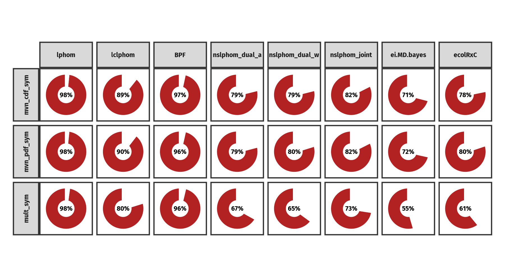

# Non-Parametric Ecological Inference Supplementary Material

R scripts with the supplementary material for the paper “An Accurate, Fast, and Scalable Ecological Inference Algorithm for the R×C Case,” by P. Ubilla, D. Hermosilla, and C. Thraves. 

- Layout: `src/` holds scripts and shared helpers; `output/` stores intermediate results such as `ei_instances`, `simulated_instances`; `figures/` receives generated PDF plots.

## Scripts
- Generate EI datasets: `Rscript src/run_instances.R`.

- Pairwise method pies: `Rscript src/pie_chart.R [outfile] [--field=EI_V] [--inst-like=ei_] [--limit-inst=N] [--workers=M] [--parallel=true] [--higher-better=true]`

- Differences and p-values: `Rscript src/p_values.R <target_method> [field_to_test] [--inst-like=ei_] [--limit-inst=N] [--workers=M] [--parallel=true]`.

- EI instance table: `Rscript src/table.R <field_to_average> [outfile.tex] [workers] [--inst-like=ei_] [--limit-inst=N] [--parallel=true]` (also prints ASCII and writes XLSX next to the TEX file).

| Method           | NZ'02  | NZ'05  | SC'07  | NZ'08  | NZ'11  | NZ'14  | NZ'17  | NZ'20  | Mean   |
|:----------------:|:------:|:------:|:------:|:------:|:------:|:------:|:------:|:------:|:------:|
| lphom            | 16.878 | 12.142 | 12.918 | 12.218 | 12.992 | 12.950 | 12.201 | 14.024 | 13.284 |
| lclphom          | 12.986 | 9.691  | 8.932  | 9.363  | 9.708  | 9.878  | 9.149  | 10.582 | 10.026 |
| nslphom_dual_a   | 11.156 | 8.637  | 7.119  | 8.082  | 9.027  | 9.056  | 8.003  | 8.513  | 8.685  |
| nslphom_dual_w   | 11.216 | 8.567  | **7.103** | 8.019  | 8.954  | 8.970  | 7.918  | 8.476  | 8.639  |
| nslphom_joint    | 11.494 | 8.853  | 7.525  | 8.492  | 9.297  | 9.374  | 8.233  | 8.940  | 9.013  |
| BPF              | 11.972 | 9.975  | 9.698  | 11.287 | 10.535 | 9.765  | 9.235  | 10.598 | 10.375 |
| ei.md.bayes      | 10.757 | 8.435  | 19.684 | 8.605  | 7.697  | 7.761  | 7.256  | 8.420  | 9.867  |
| ecolRxC          | 10.898 | 8.807  | 17.380 | 7.564  | 8.201  | 8.591  | 6.787  | 7.555  | 9.500  |
| mvn_cdf          | 9.535  | 6.989  | 8.468  | 6.518  | 7.236  | 7.239  | 6.061  | 6.044  | 7.258  |
| mvn_cdf_sym      | 9.520  | 6.902  | 8.150  | 6.384  | 7.169  | 7.167  | 6.008  | 5.930  | 7.149  |
| mvn_pdf          | 9.520  | 6.961  | 8.198  | 6.461  | 7.160  | 7.197  | 6.002  | 5.952  | 7.177  |
| mvn_pdf_sym      | **9.464** | **6.881** | 8.109  | **6.342** | **7.091** | **7.123** | **5.938** | **5.843** | **7.094** |
| mult             | 11.013 | 8.166  | 8.866  | 7.829  | 8.436  | 8.270  | 7.216  | 7.319  | 8.381  |
| mult_sym         | 10.493 | 7.930  | 8.525  | 7.493  | 8.194  | 8.117  | 6.866  | 7.243  | 8.101  |

- Simulated-instance table: `Rscript src/table_simulated.R <field_to_average> [outfile.tex] [workers] [--inst-like=I] [--limit-inst=N] [--parallel=true]`.

| Candidates | 2 | 2 | 2 | 2 | 2 | 3 | 3 | 3 | 3 | 3 |
|:----------:|:--:|:--:|:--:|:--:|:--:|:--:|:--:|:--:|:--:|:--:|
| Groups     | 2 | 3 | 4 | 6 | 8 | 2 | 3 | 4 | 6 | 8 |
| ei.md.bayes      | 1.16 | 1.72 | 2.31 | 3.46 | 4.22 | 1.24 | 1.77 | 2.17 | 3.19 | 3.70 |
| nslphom_dual_w   | 1.45 | 1.59 | 1.91 | 2.41 | 2.54 | 2.19 | 1.71 | 2.04 | 2.25 | 2.44 |
| mvn_cdf          | 0.74 | **1.24** | 1.71 | **2.18** | **2.46** | 1.18 | 1.39 | **1.78** | **2.06** | 2.30 |
| mvn_pdf          | 0.74 | **1.24** | 1.71 | **2.18** | **2.46** | 1.18 | 1.39 | 1.79 | **2.06** | 2.30 |
| mult             | **0.73** | 1.25 | **1.70** | 2.20 | **2.46** | **1.17** | 1.39 | 1.81 | 2.07 | 2.30 |
| exact            | 0.74 | **1.24** | 1.71 | 2.19 | **2.46** | **1.17** | **1.38** | 1.80 | **2.06** | **2.29** |

| Candidates | 5 | 5 | 5 | 5 | 5 | 10 | 10 | 10 | 10 | 10 |
|:----------:|:--:|:--:|:--:|:--:|:--:|:--:|:--:|:--:|:--:|:--:|
| Groups     | 2 | 3 | 4 | 6 | 8 | 2 | 3 | 4 | 6 | 8 |
| ei.md.bayes      | 1.01 | 1.59 | 1.98 | 2.58 | 3.10 | 0.74 | 1.20 | 1.37 | 1.85 | 2.26 |
| nslphom_dual_w   | 1.52 | 1.58 | 1.83 | 1.88 | 2.22 | 0.99 | 1.11 | 1.22 | 1.52 | 1.71 |
| mvn_cdf          | **0.86** | **1.23** | **1.52** | **1.73** | **2.09** | **0.61** | **0.88** | **1.08** | **1.37** | **1.62** |
| mvn_pdf          | **0.86** | **1.23** | 1.53 | 1.74 | **2.09** | **0.61** | **0.88** | **1.08** | **1.37** | **1.62** |
| mult             | **0.86** | 1.24 | **1.52** | 1.74 | **2.09** | **0.61** | **0.88** | **1.08** | **1.37** | **1.62** |
| exact            | -- | -- | -- | -- | -- | -- | -- | -- | -- | -- |

- Scalability benchmark: `Rscript src/scalability.R [--parallel]` (writes `output/scalability_results*.csv`).

| Electoral units | 1000 |  |  |  | 5000 |  |  |  | 10000 |  |  |  | 50000 |  |  |  |
|:---------------:|:----:|:--:|:--:|:--:|:----:|:--:|:--:|:--:|:-----:|:--:|:--:|:--:|:-----:|:--:|:--:|:--:|
| **Voters [thousands]** | 0.1 | 1 | 10 | 100 | 0.1 | 1 | 10 | 100 | 0.1 | 1 | 10 | 100 | 0.1 | 1 | 10 | 100 |
| lphom            | ✓ | ✓ | ✓ | ✓ |  |  |  |  |  |  |  |  |  |  |  |  |
| lclphom          | ✓ | ✓ | ✓ | ✓ |  |  |  |  |  |  |  |  |  |  |  |  |
| nslphom_dual_a   | ✓ | ✓ | ✓ | ✓ |  |  |  |  |  |  |  |  |  |  |  |  |
| nslphom_dual_w   | ✓ | ✓ | ✓ | ✓ |  |  |  |  |  |  |  |  |  |  |  |  |
| nslphom_joint    | ✓ | ✓ | ✓ | ✓ |  |  |  |  |  |  |  |  |  |  |  |  |
| ei.md.bayes      | ✓ | ✓ | ✓ | ✓ | ✓ | ✓ | ✓ | ✓ | ✓ | ✓ | ✓ | ✓ |  |  |  |  |
| BPF | ✓ | ✓ | ✓ | ✓ | ✓ | ✓ | ✓ | ✓ | ✓ | ✓ | ✓ | ✓ | ✓ | ✓ | ✓ | ✓ |
| ecolRxC          | ✓ | ✓ | ✓ | ✓ |  |  |  |  |  |  |  |  |  |  |  |  |
| mvn_cdf          | ✓ | ✓ | ✓ | ✓ | ✓ | ✓ | ✓ | ✓ | ✓ | ✓ | ✓ | ✓ | ✓ | ✓ | ✓ | ✓ |
| mvn_cdf_sym      | ✓ | ✓ | ✓ | ✓ | ✓ | ✓ | ✓ | ✓ | ✓ | ✓ | ✓ | ✓ | ✓ | ✓ | ✓ | ✓ |
| mvn_pdf          | ✓ | ✓ | ✓ | ✓ | ✓ | ✓ | ✓ | ✓ | ✓ | ✓ | ✓ | ✓ | ✓ | ✓ | ✓ | ✓ |
| mvn_pdf_sym      | ✓ | ✓ | ✓ | ✓ | ✓ | ✓ | ✓ | ✓ | ✓ | ✓ | ✓ | ✓ | ✓ | ✓ | ✓ | ✓ |
| mult             | ✓ | ✓ | ✓ | ✓ | ✓ | ✓ | ✓ | ✓ | ✓ | ✓ | ✓ | ✓ | ✓ | ✓ | ✓ | ✓ |
| mult_sym         | ✓ | ✓ | ✓ | ✓ | ✓ | ✓ | ✓ | ✓ | ✓ | ✓ | ✓ | ✓ | ✓ | ✓ | ✓ | ✓ |

- EM start sensitivity demo: `Rscript src/starting_point.R` (runs a small grid of random starts and prints Frobenius norms).

|  G  |  C  |  mean   |   s.d.  |  max.   |
|:---:|:---:|:-------:|:-------:|:-------:|
| 2 | 2 | 0.0026 | 0.0038 | 0.0096 |
| 2 | 3 | 0.0038 | 0.0028 | 0.0096 |
| 2 | 4 | 0.0046 | 0.0027 | 0.0117 |
| 3 | 2 | 0.0027 | 0.0021 | 0.0082 |
| 3 | 3 | 0.0038 | 0.0021 | 0.0082 |
| 3 | 4 | 0.0070 | 0.0051 | 0.0209 |
| 4 | 2 | 0.0034 | 0.0026 | 0.0116 |
| 4 | 3 | 0.0072 | 0.0060 | 0.0258 |
| 4 | 4 | 0.0067 | 0.0059 | 0.0246 |

